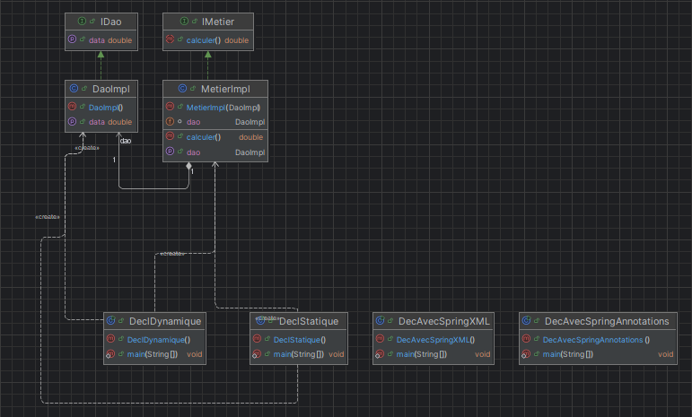

## Documentation
### Création d'une couche DAO
Interface:
```java
public interface IDao {
    double getData();
}
```

Implémentation:
```java
public class DaoImpl implements IDao {
    @Override
    public double getData() {
    double data = 121.65;
            return data;
        }
}
```

### Création de la couche Métier
Interface:
```java
public interface IMetier {
    double calculer();
}
```
Implémentation:
```java
public class MetierImpl implements IMetier {
    DaoImpl dao;

    public MetierImpl(DaoImpl dao) {
        this.dao = dao;
    }

    public void setDao(DaoImpl dao) {
        this.dao = dao;
    }

    @Override
    public double calculer() {
        double data = dao.getData();
        return data * 5;
    }
}
```

### Création d'une couche présentation
#### Déclaration Statique:
```java
public static void main(String[] args) {
    DaoImpl dao = new DaoImpl();
    MetierImpl metier = new MetierImpl(dao);
    System.out.println(metier.calculer());
}
```
#### Déclaration Dynamique:
```java
public static void main(String[] args) {
    DaoImpl dao;
    dao = new DaoImpl();
    MetierImpl metier;
    metier = new MetierImpl(dao);
    System.out.println(metier.calculer());
}
```
#### Déclaration Avec Fichier Config XML Spring:
```java
public static void main(String[] args) {
    ApplicationContext context = new ClassPathXmlApplicationContext("config.xml");
    IMetier metier = (IMetier) context.getBean("metier");
    System.out.println(metier.calculer());
}
```
#### Déclaration Avec Annotation Spring:
```java
public static void main(String[] args) {
    ApplicationContext context = new AnnotationConfigApplicationContext("org.example");
    IMetier metier = context.getBean(IMetier.class);
    System.out.println(metier.calculer());
}
```
## Diagramme de classe

